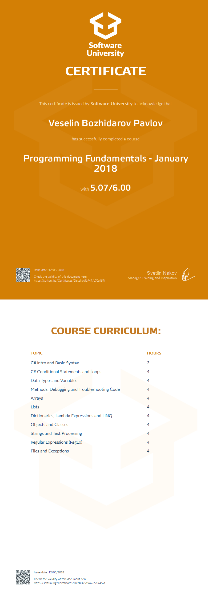

# Course: Programming Fundamentals with C#

## Topics:
01. C# Intro and Basic Syntax
02. C# Conditional Statements and Loops
03. Data Types and Variables 
04. Methods. Debugging and Troubleshooting Code
05. Arrays
06. Lists
07. Dictionaries, Lambda and LINQ
08. Objects and Classes
09. Strings and Text Processing
10. Regular Expressions (RegEx)
11. Files and Exceptions

## Status:
Completed

## Certificate:

